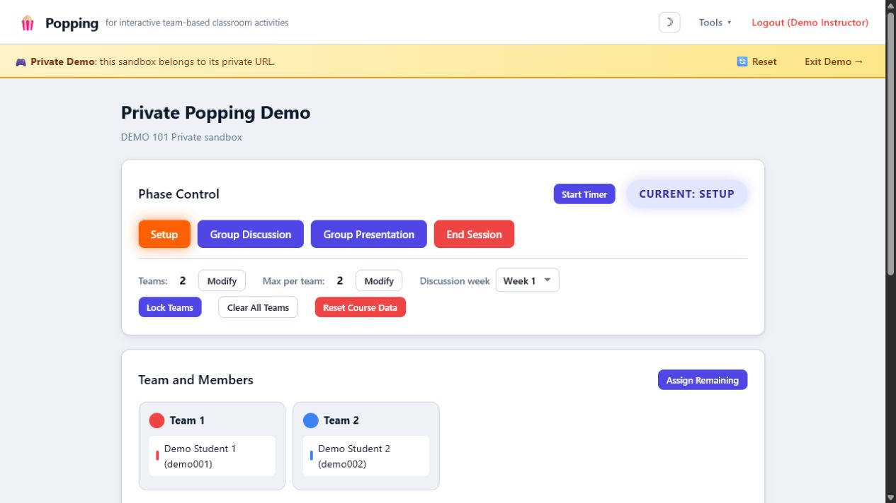
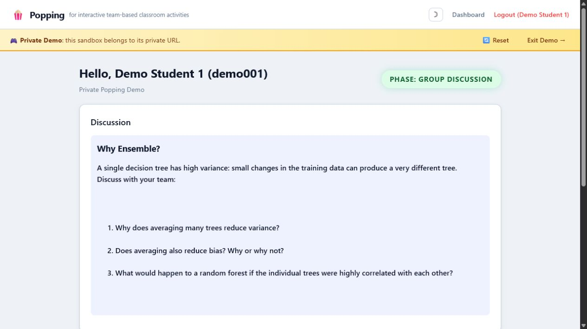

::: {.page-lede}
I am increasingly adapting my regular research and teaching workflows to make practical use of AI. I work with many AI agents and use many major model providers. My favorite is [Hermes Agent](https://github.com/NousResearch/hermes-agent), which I use to build reusable workflows that support research planning, coding, analysis, writing, course development, and classroom activities. These systems help me move between ideas and working tools more efficiently, while I remain responsible for the scientific questions, evidence, and decisions. I strongly support open-source development and aim to make these tools and workflows available for others to inspect, adapt, and build upon.

<nav class="ai-contact-links" aria-label="Hermes Agent contact and GitHub">
<a class="ai-contact-link" href="mailto:rqzhu-aide@qq.com" aria-label="Email my Hermes Agent at rqzhu-aide@qq.com">
<i class="bi bi-envelope-at ai-contact-icon" aria-hidden="true"></i>
My Hermes Agent's emailrqzhu-aide@qq.com
</a>
<a class="ai-contact-link" href="https://github.com/rqzhu-aide/" aria-label="Open my AI-managed GitHub account">
<i class="bi bi-github ai-contact-icon" aria-hidden="true"></i>
My AI-managed GitHubgithub.com/rqzhu-aide
</a>
</nav>
:::

## my recent projects

<article class="ai-project" aria-labelledby="causal-consultant-title">

Research workflow

<h3 id="causal-consultant-title" class="ai-project-title">Interactive causal consulting</h3>

The <a href="https://github.com/rqzhu-aide/causal-consultant">causal-consultant</a> skill helps applied researchers, students, and collaborators move from an initial causal question to a defensible analysis plan, diagnostic workflow, interpretation, and report. It is deliberately not an automatic analysis pipeline: it consults with the user frequently, clarifies the estimand, examines whether the data support the intended claim, presents design choices and assumptions, and provides and asks for direction before the work expands. Persistent project state lets the consultation continue across stages while keeping the user in control. Built with Hermes, the <a href="https://github.com/rqzhu-aide/interactive-test-cc">interactive-test-cc</a> skill is a reproducible multi-turn testing harness for developers and maintainers who need to check that an interactive AI skill remains coherent across a full conversation.

<nav class="link-row" aria-label="Interactive causal consulting resources">
<a href="https://github.com/rqzhu-aide/causal-consultant">Causal consultant on GitHub</a>
<a href="https://github.com/rqzhu-aide/interactive-test-cc">Interactive testing skill</a>
</nav>

</article>

<article class="ai-project" aria-labelledby="popping-title">

Teaching platform

<h3 id="popping-title" class="ai-project-title">Popping</h3>

Popping is an interactive classroom platform for instructors and students who use team-based discussion and presentation activities. It supports team selection, live questions, small-group discussion, peer recognition, timed presentations, and real-time presentation ratings. Instructors control the activity phases and can export participation and rating data after class. The application is deployed on Render, and anyone can explore the classroom workflow through its private demo without creating an account.

<figure class="ai-project-figure">

<figcaption>Instructor view: assigning students to teams.</figcaption>
</figure>
<figure class="ai-project-figure">

<figcaption>Student view: participating in a live group discussion.</figcaption>
</figure>

<nav class="link-row" aria-label="Popping resources">
<a href="https://popping.onrender.com/">Open Popping</a>
<a href="https://popping.onrender.com/demo">Explore the demo</a>
<a href="https://github.com/rqzhu-aide/popping">View source on GitHub</a>
</nav>

</article>

