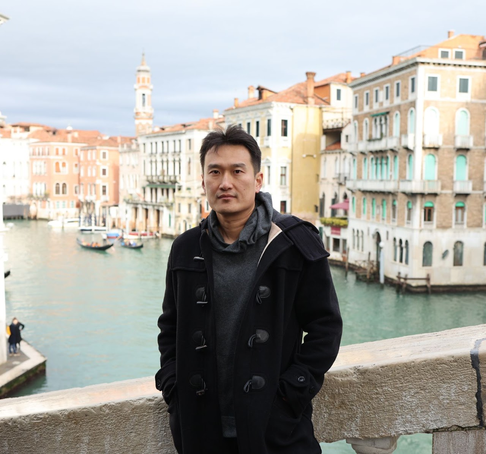

---
format:
  html:
    page-layout: full
---

::: {.home-justify}
::: {.top-panel}
::: {.grid}
::: {.g-col-8}
## Zhu, Ruoqing  (朱若青) 

**Associate Professor**, [Department of Statistics](https://stat.illinois.edu/) 
University of Illinois Urbana-Champaign

  Office:
  605 E. Springfield Ave., 137 CAB, Champaign, IL 61820

**Affiliations:**

- [Carle Illinois College of Medicine](https://medicine.illinois.edu/) (Inaugural Member)
- [Division of Nutritional Sciences](https://nutrsci.illinois.edu/)
- [National Center for Supercomputing Applications](https://www.ncsa.illinois.edu/)
- [Carl R. Woese Institute for Genomic Biology](https://www.igb.illinois.edu/)
:::
::: {.g-col-4}
{.top-panel-photo}
:::
:::

:::
## Research Interests

I have a broad interest in developing statistical methodology, theory, and computational algorithms for decision-making problems, particularly in personalized medicine and reinforcement learning. Many existing models are rejected by practitioners due to unrealistic assumptions, unstable performance, lack of interpretability, and challenges posed by small sample sizes, high dimensionality, and complex data structures. Addressing these issues is both a challenging and exciting task in statistical research. My recent work focuses on uncertainty quantification, distributional shift, casual inference, and trustworthiness, aiming to develop more reliable and practical solutions for real-world applications. In addition, I have a strong interest in classical statistical learning and machine learning methods, including random forests, sufficient dimension reduction, and survival analysis, with applications in bioinformatics, infectious diseases, and nutrition studies.

## Short Bio

Before joining UIUC, I was a postdoctoral associate at Yale University jointly supervised by [Hongyu Zhao](https://ysph.yale.edu/profile/hongyu-zhao/) and [Shuangge Ma](https://ysph.yale.edu/profile/shuangge-ma/). I received my PhD in Biostatistics from the University of North Carolina at Chapel Hill in 2013 under the supervision of [Michael Kosorok](https://mkosorok.web.unc.edu/), and a MA in Statistics from Bowling Green State University in 2008. Prior to that, I obtained my BS in Mathematics and BS in Financial Engineering from Nanjing University in China.
:::