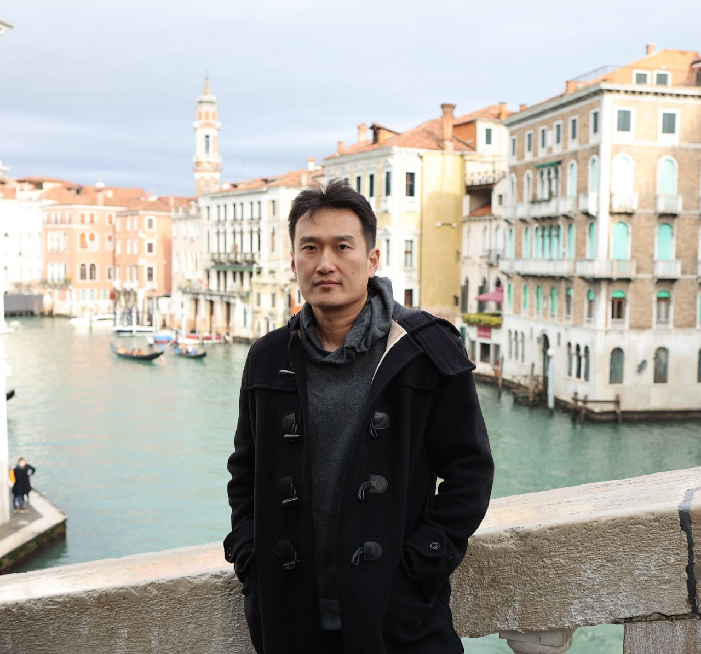

::: {.home-page}
<section class="home-hero">

Ruoqing Zhu

朱若青

Associate Professor of Statistics University of Illinois Urbana-Champaign

<nav class="hero-actions" aria-label="Profile links">
<a href="https://scholar.google.com/citations?user=uyzMyb8AAAAJ&amp;hl=en">Google Scholar</a>
</nav>

</section>

<svg viewBox="0 0 700 150" aria-hidden="true" focusable="false">
<path class="trace-stroke" pathLength="1" d="M22 75 H455"></path>
<path class="trace-stroke" pathLength="1" d="M22 62 V88 M390 62 V88"></path>
<path class="trace-stroke" pathLength="1" d="M455 75 L555 25 H690 M455 75 H690 M455 75 L555 125 H690"></path>
<circle class="trace-node" cx="455" cy="75" r="6"></circle>
</svg>
<nav class="trace-nav" aria-label="Research themes">
<ul class="trace-labels">
<li><a href="research.html#reliable-learning">Reliable statistical decision making</a></li>
<li><a href="research.html#biomedical-translation">Biomedical translation</a></li>
<li><a href="research.html#ai-related">Agentic AI for research and education</a></li>
</ul>
</nav>

## Research interests {.home-section-heading}

::: {.interest-grid}
::: {.interest-item}
### Reliable statistical decision making

Uncertainty quantification, causal inference, personalized medicine, and reinforcement learning for decisions that remain reliable in practice.
:::

::: {.interest-item}
### Biomedical translation

Statistical machine learning for sepsis, infectious diseases, nutrition science, diagnostics and other scientific domains.
:::

::: {.interest-item}
### Agentic AI for research and education

Utilizing agentic AI to enhance research workflows, scientific discovery, teaching, and learning.
:::
:::

::: {.home-lower}
::: {.home-bio}
## Short bio

Before joining UIUC, I was a postdoctoral associate at Yale University jointly supervised by [Hongyu Zhao](https://ysph.yale.edu/profile/hongyu-zhao/) and [Shuangge Ma](https://ysph.yale.edu/profile/shuangge-ma/). I received my PhD in Biostatistics from the University of North Carolina at Chapel Hill in 2013 under the supervision of [Michael Kosorok](https://mkosorok.web.unc.edu/), and a MA in Statistics from Bowling Green State University in 2008. Prior to that, I obtained my BS in Mathematics and BS in Financial Engineering from Nanjing University in China.
:::

::: {.home-affiliations}
## Affiliations

<ul class="affiliation-list">
<li><a href="https://stat.illinois.edu/">Department of Statistics</a></li>
<li><a href="https://medicine.illinois.edu/">Carle Illinois College of Medicine</a>, inaugural member</li>
<li><a href="https://nutrsci.illinois.edu/">Division of Nutritional Sciences</a></li>
<li><a href="https://www.ncsa.illinois.edu/">National Center for Supercomputing Applications</a></li>
<li><a href="https://www.igb.illinois.edu/">Carl R. Woese Institute for Genomic Biology</a></li>
<li><a href="https://prenosis.com/team/">Prenosis Inc.</a>, Advisory Board Member</li>
</ul>

<address class="office-address">
<strong>Office</strong> 
605 E. Springfield Ave., 137 CAB 
Champaign, IL 61820

<strong>Contact</strong> 
<a href="mailto:rqzhu@illinois.edu">rqzhu@illinois.edu</a>

</address>
:::
:::
:::
