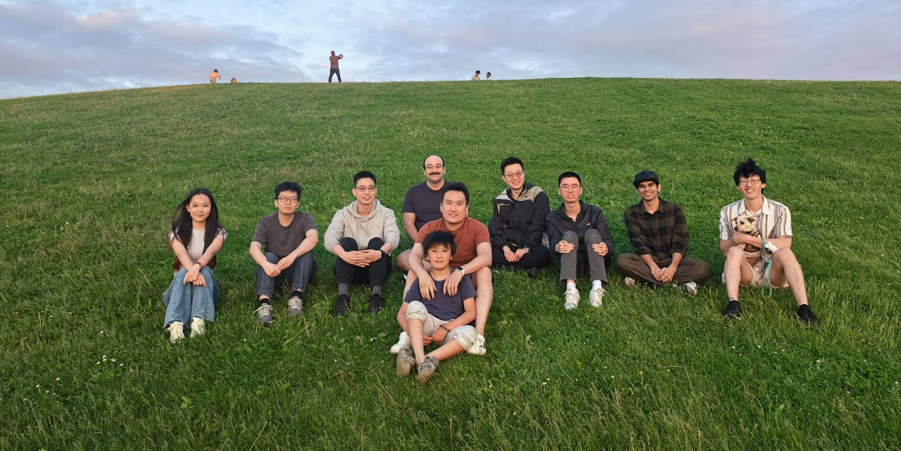
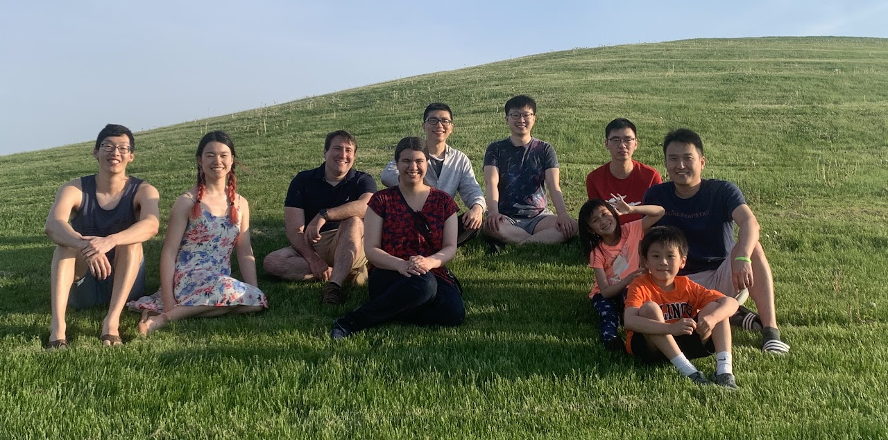
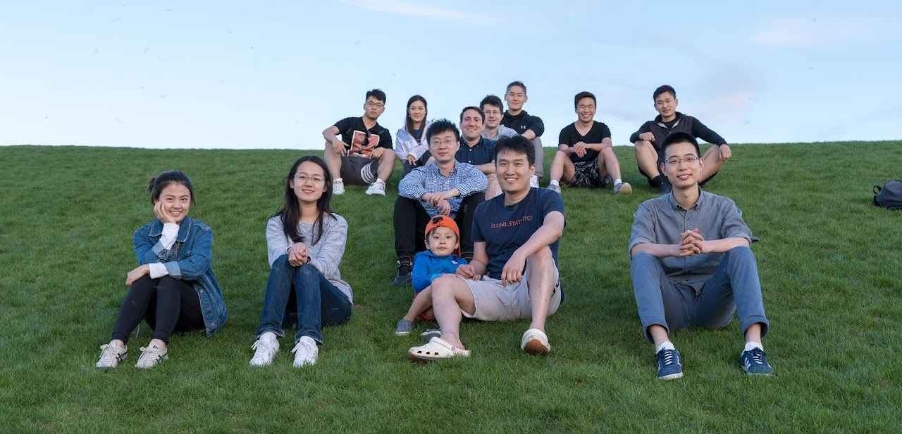

---
---

## Current Members

::: {.grid}
::: {.g-col-4}
**PhD**

- Eugene Han (2022-)
- Mehrdad Mohammadi (2022-)
- Zhiyu Wang (2023-)
- Zexuan Zhang (2024-)
- Zhaohao Su (2025-)
- Amitakshar Biswas (2025-)
:::
::: {.g-col-4}
**MS**

- Bhoomika Ravishankar
:::
::: {.g-col-4}
**BS**

- Nathan Chen
- Mark Samuel
:::
:::

## Previous Members

**PhD**

- Yuhan Li (2025), IMC Trading
- [Tianning Xu](https://www.linkedin.com/in/tianning-xu/) (2024), Amazon &#10132; Waymo
- [Wenzhuo Zhou](https://sites.google.com/view/wenzhuozhou/home/) (2022), Postdoc @UCI &#10132; AP @UCI
- [Sarah E. Formentini](https://www.linkedin.com/in/sarah-formentini-43000563/) (2022), Bayer
- [Joshua D. Loyal](https://joshloyal.github.io/) (2022), AP @FSU
- [Yutong (Jack) Li](https://www.linkedin.com/in/yutong-li-nyc/) (2021), Novartis
- [William Biscarri](https://www.linkedin.com/in/williambiscarri/) (2019), J.P. Morgan

**MS**

- Chengyu Du (2024), PhD @UMass Amherst
- Haowen Zhou (2023), PhD @UVA
- [Yue Mu](https://www.linkedin.com/in/yue-mu-57ba21149/) (2018), PhD @FSU
- Jiyang Zhang (2018)
- [Peng Xu](https://francis-hsu.github.io/) (2017), PhD @UIUC
- [Ruizhong Miao](https://www.linkedin.com/in/ruizhong-miao-7227b7184/) (2017), PhD @UVA
- [Boyi Guo](https://boyi-guo.com/) (2017), PhD @UAB &#10132; Postdoc @JHU &#10132; AP @University of Utah

**BS**

- [Mingrui Xu](https://www.linkedin.com/in/mingrui-xu-03a94924b/) (2025), MS @JHU
- [Ruilin Zhao](https://www.linkedin.com/in/ruilin-zhao-7a1956149/) (2018), MS @U Penn
- [Hao Wang](https://www.linkedin.com/in/hao-wang-25b7a61a1/) (2018), PhD @Berkeley &#10132; AbbVie

## Group Photos

::: {.grid}
::: {.g-col-6}

May 17, 2025. Photo by Hengrui Cai
:::
::: {.g-col-6}

May 12, 2022. Photo by Xian Cao
:::
::: {.g-col-6}

2019. Photo by Xian Cao
:::
:::
