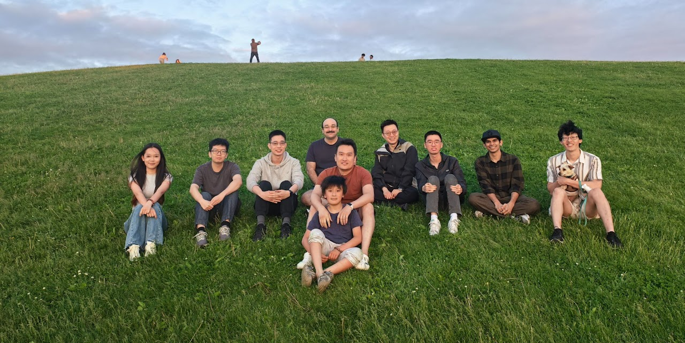
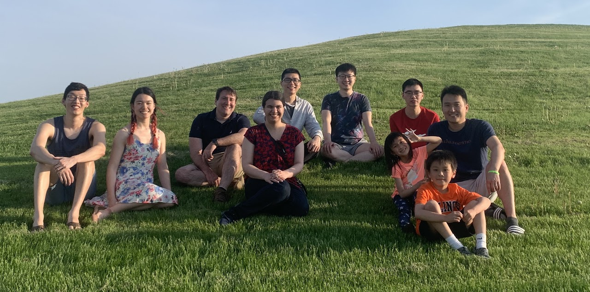
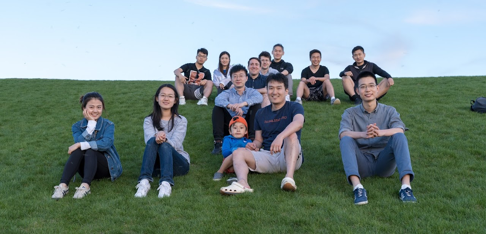

::: {.page-lede}
Students and collaborators working across statistics, machine learning, and biomedical applications.
:::

## Current members

::: {.member-groups}
::: {.member-group}
### PhD

- Eugene Han (2022-)
- Mehrdad Mohammadi (2022-)
- Zhiyu Wang (2023-)
- Zexuan Zhang (2024-)
- Zhaohao Su (2025-)
- Amitakshar Biswas (2025-)
:::

::: {.member-group}
### MS

- Bhoomika Ravishankar
- Jiahui Zhang
:::

::: {.member-group}
### BS

- Nathan Chen
- Mark Samuel
- Jianing Xie
:::
:::

## Previous members

::: {.alumni-groups}
::: {.alumni-group}
### PhD

- Yuhan Li (2025), IMC Trading
- [Tianning Xu](https://www.linkedin.com/in/tianning-xu/) (2024), Amazon → Waymo
- [Wenzhuo Zhou](https://sites.google.com/view/wenzhuozhou/home/) (2022), Postdoc at UCI → AP at UCI
- [Sarah E. Formentini](https://www.linkedin.com/in/sarah-formentini-43000563/) (2022), Bayer
- [Joshua D. Loyal](https://joshloyal.github.io/) (2022), AP at FSU
- [Yutong (Jack) Li](https://www.linkedin.com/in/yutong-li-nyc/) (2021), Novartis
- [William Biscarri](https://www.linkedin.com/in/williambiscarri/) (2019), J.P. Morgan
:::

::: {.alumni-group}
### MS

- Zirui Li (2026)
- [Sarthak Morj](https://www.linkedin.com/in/sarthakmorj/) (2025), Credit Acceptance
- Chengyu Du (2024), PhD at UMass Amherst
- Haowen Zhou (2023), PhD at UVA
- [Yue Mu](https://www.linkedin.com/in/yue-mu-57ba21149/) (2018), PhD at FSU
- Jiyang Zhang (2018)
- [Peng Xu](https://francis-hsu.github.io/) (2017), PhD at UIUC
- [Ruizhong Miao](https://www.linkedin.com/in/ruizhong-miao-7227b7184/) (2017), PhD at UVA
- [Boyi Guo](https://boyi-guo.com/) (2017), PhD at UAB → Postdoc at JHU → AP at University of Utah
:::

::: {.alumni-group}
### BS

- Jiyang Xu (2025), PhD at UC Irvine
- Yiheng Yang (2025), MS at U Chicago
- [Mingrui Xu](https://www.linkedin.com/in/mingrui-xu-03a94924b/) (2025), MS at JHU
- [Ruilin Zhao](https://www.linkedin.com/in/ruilin-zhao-7a1956149/) (2018), MS at U Penn
- [Hao Wang](https://www.linkedin.com/in/hao-wang-25b7a61a1/) (2018), PhD at Berkeley → AbbVie
:::
:::

## Group photos

::: {.group-photo-feature}
{.group-photo-image fig-alt="Ruoqing Zhu's research group gathered outdoors in 2025." width="1280" height="642" loading="lazy" decoding="async"}
:::

::: {.group-photo-secondary-grid}
::: {.group-photo-secondary}
{.group-photo-image fig-alt="Ruoqing Zhu's research group gathered outdoors in 2022." width="1280" height="635" loading="lazy" decoding="async"}
:::

::: {.group-photo-secondary}
{.group-photo-image fig-alt="Ruoqing Zhu's research group gathered outdoors in 2019." width="1280" height="618" loading="lazy" decoding="async"}
:::
:::
